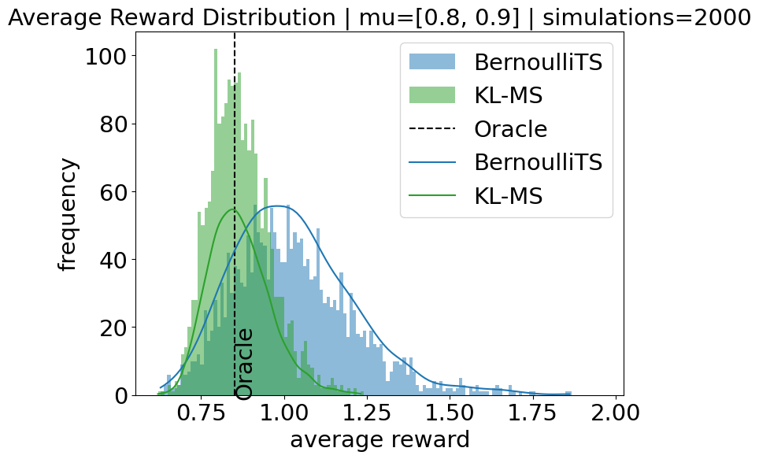
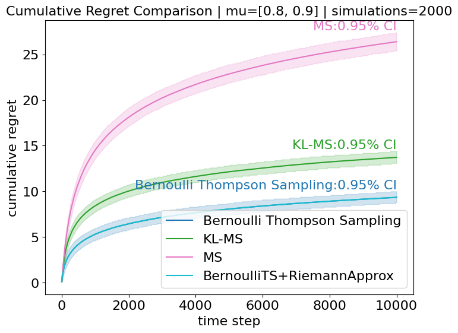

# Kullback-Leibler Maillard Sampling for Multi-armed Bandits with Bounded Rewards

This official repository contains the implementation of the algorithms discussed in the paper **[Kullback-Leibler Maillard Sampling for Multi-armed Bandits with Bounded Rewards](https://proceedings.neurips.cc/paper_files/paper/2023/hash/bdebb4549d5a79501bc151411abdb6d7-Abstract-Conference.html)**. The paper introduces a novel approach to solving the multi-armed bandit problem using Kullback-Leibler divergence following the Maillard Sampling rule to achieve a highly efficient bandit algorithm.

## Abstract

We study K-armed bandit problems where the reward distributions of the arms are all supported on the $[0,1]$ interval. It has been a challenge to design regret-efficient randomized exploration algorithms in this setting. [Maillard sampling](https://theses.hal.science/tel-00845410), an attractive alternative to Thompson sampling, has recently been shown to achieve competitive regret guarantees in the sub-Gaussian reward setting [[Maillard Sampling: Boltzmann Exploration Done Optimally](https://proceedings.mlr.press/v151/bian22a/bian22a.pdf)] while maintaining closed-form action probabilities, which is useful for offline policy evaluation. In this work, we propose the Kullback-Leibler Maillard Sampling (KL-MS) algorithm, a natural extension of Maillard sampling for achieving KL-style gap-dependent regret bound. We show that KL-MS enjoys the asymptotic optimality when the rewards are Bernoulli and has a worst-case regret bound of the form $O(\sqrt{μ^∗(1−μ^∗)KT\ln(K)} + K\ln(T))$, where $μ^∗$ is the expected reward of the optimal arm, and $T$ is the time horizon length.

## Installation

To run the code, ensure you have Python installed. You can clone this repository and install the necessary dependencies using:

```bash
git clone https://github.com/MjolnirT/Kullback-Leibler-Maillard-Sampling
cd Kullback-Leibler-Maillard-Sampling
pip install -r requirements.txt
```

## Experiment

The experiment consists of two main steps:

1. **Run Simulation in a Bandit Environment**: In this step, the main simulation is executed using the configuration file generated in the previous step. This simulation will run the KL-MS algorithm in a predefined bandit environment, allowing you to observe its performance.

    ```bash
    python running_simulations.py <path-to-config>
    ```

2. **Run Offline Evaluation**: After the simulation, an offline evaluation is conducted to analyze the results. This step helps in assessing the performance of the KL-MS algorithm by comparing it with other traditional bandit algorithms.

    ```bash
    python evaluation.py <path-to-config>
    ```

3. (Option) **Generating figures using obtained simulation and evaluation results**: Although we have already obtained desired cumulative and average regret plots by executing the above two steps, we can utilize obtained data to generate those plots without re-running the whole experiments.
    ```bash
    # navigate to the source folder
    cd kl-maillard-sampling
    # generating simulation plots
    python -m src.utility_functions.generate_plots <path-to-config>
    # generating offline evaluation plots
    python -m src.utility_functions.generate_eval_plots <path-to-config> 
    ```
### Examples

To generate Figure 1 in the main body of paper (Page 2), we should choose figure file `figure1_main.json` in the folder `config` and run following commands:
```bash
cd kl-maillard-sampling
python running_simulations.py ./config/figure1_main.json
python evaluation.py ./config/figure1_main.json
```

After running the simulation and offline evaluation, you should obtain a `data` folder and a `figures` folder. The desired plot should be in the `figures` folder, named `eval_reward_hist.png`. The `data` folder contains all simulation results and evaluation results.

## Results

The results of our experiments demonstrate the effectiveness of the KL-MS algorithm in environments with bounded rewards. The algorithm achieves performance comparable to the best traditional bandit algorithms, while maintaining an unbiased estimation during offline evaluation. The following figures illustrate the estimated policy performance and cumulative regret:

<div align="center">
  
</div>

The histogram above shows the estimated policy performance from the offline evaluation, indicating that KL-MS provides unbiased estimates as well as lower variance.

<div align="center">
  
</div>

The plot above depicts the cumulative regret with a confidence interval, highlighting the algorithm's efficiency in minimizing regret over time compared to MS and MS+.

## Self-defined Experiment

To create a self-defined experiment, you can use the `generate_config.py` script to create configuration files tailored to your specific needs. This script allows you to define the parameters for the bandit environment and the algorithms you want to test directly within the script.

### Steps to Create a Self-defined Experiment

1. **Generate Configuration File**: Modify the `generate_config.py` script to set your desired parameters. The script includes variables for the number of simulations, the reward distribution, the algorithms to be used, and their respective parameters. Once configured, run the script to generate the configuration file. We assume reward distributions are Bernoulli and we only use their means to define reward distribution.

    **Explanation of Parameters:**
    - `TEST_CASE`: Determines the reward distribution. Set to `1` for `[0.2, 0.25]` or `2` for `[0.8, 0.9]`.
    - `ENV_REWARD`: Reward distribution for the bandit environment, automatically set based on `TEST_CASE`.
    - `N_SIMULATIONS`: Number of simulations to run. Default is 2000.
    - `T_TIMESPAN`: Time horizon length for each simulation. Default is 10000.
    - `INCLUDED_ALG`: List of algorithms to be tested. Options include `BernoulliTS`, `KL-MS`, `KL-MS+JefferysPrior`, `MS`, `MS+`, and `simuBernoulliTS`.
    - `MC_SIMULATION_ROUND`: Number of Monte Carlo simulation rounds for `BernoulliTS`.
    - `VARIANCE`: Variance parameter for `MS` and `MS+`.

    After setting these parameters, run the script:

    ```bash
    python generate_config.py
    ```

2. **Run Simulation in a Bandit Environment**: Once you have generated the configuration file, you can run the main simulation using the `running_simulations.py` script.

    ```bash
    python running_simulations.py <path-to-config>
    ```

3. **Run Offline Evaluation**: After the simulation, use the `evaluation.py` script to conduct an offline evaluation and analyze the results.

    ```bash
    python evaluation.py <path-to-config>
    ```

By following these steps, you can create and run your own experiments to test different algorithms in a bandit environment. Make sure to review the generated configuration file to ensure it meets your experimental requirements.

## Citation

If you use this code or the ideas presented in the paper, please cite:

```
@article{qin2024kullback,
  title={Kullback-leibler maillard sampling for multi-armed bandits with bounded rewards},
  author={Qin, Hao and Jun, Kwang-Sung and Zhang, Chicheng},
  journal={Advances in Neural Information Processing Systems},
  volume={36},
  year={2024}
}
```

## License

This project is licensed under the MIT License - see the [LICENSE](LICENSE) file for details.
